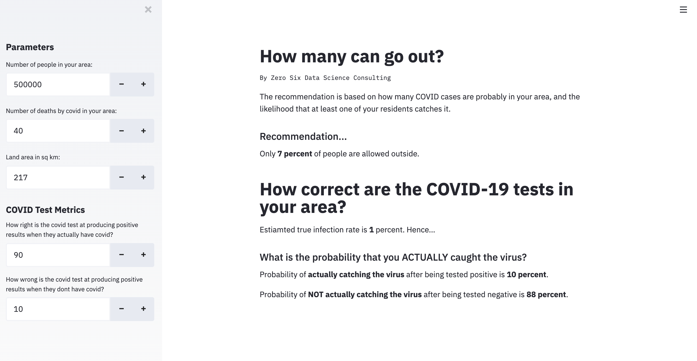

# Social Distancing  Calculator Web Application  
Author: Xavier M. Puspus  

### Deployed Application  
Here's a [link](https://social-distance-calculator.herokuapp.com/) to the web application hosted in Heroku.

### Description
Here's a link to the [website](https://www.canva.com/design/DAD-1SCjuXk/duGuoYiquNMOUvdkdOPfew/view) describing the project.

### Deployment Through Web Application

I used the most recently released API of [Streamlit](https://streamlit.io) to deploy the ml model and locally serve the web app.

### Running the App

In order to run the app, you must install streamlit using:

```console
foo@bar:~$ pip install streamlit
```
Afterwards, run this on the terminal:

```console
foo@bar:~$ streamlit run app.py
```

### Display

The web app should look something like this:


